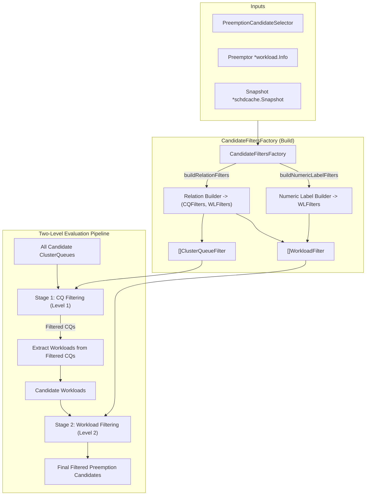

# Two-Level Preemption Filtering Architecture & Factory Design

## 1. Feature Context & Motivation
In Kueue's candidate selection pipeline, preemption rules in `PreemptionConfig` define multi-dimensional constraints (such as queue/cohort relationships, numeric label thresholds, and priority boundaries).

Evaluating every constraint individually across thousands of active cluster workloads is computationally inefficient. Because workloads in Kueue are structurally partitioned by `ClusterQueue` in the scheduler snapshot (`schdcache.Snapshot.ClusterQueue(name).Workloads`), we introduce a **2-Level Filtering Pipeline**:
1. **Level 1: ClusterQueue Level (`ClusterQueueFilter`)** — Prunes entire `ClusterQueues` (and all workloads within them) in $\mathcal{O}(1)$ operations (e.g., `SameClusterQueue`, `SameCohort`, `SameCohortTree`, `ClusterQueueSelector`).
2. **Level 2: Workload Level (`WorkloadFilter`)** — Evaluates granular workload-specific constraints (e.g., `SameLocalQueue`, `NumericLabelConstraint`, `WorkloadSelector`) only on the candidate workloads residing within the filtered ClusterQueues.

A centralized **`CandidateFiltersFactory`** parses a `PreemptionCandidateSelector` and compiles the composite set of Level 1 and Level 2 filters.

---

## 2. Architecture Overview & Data Flow



---

## 3. Key Design Principles & Clean Separation of Concerns (SRP)

### 3.1 Single Responsibility Principle (Factory vs Filters)
* **Factory Responsibility (`CandidateFiltersFactory`)**: Pure routing and assembly. It inspects which constraint fields are enabled in `PreemptionCandidateSelector` and instantiates the corresponding filter structs. It contains **no** snapshot traversal or cohort resolution logic.
* **Filter Constructor Responsibility (`NewSameCohortFilter`, `NewSameCohortTreeFilter`)**: Encapsulates all domain-specific lookup and state caching (e.g. reading `preemptor.ClusterQueue` from `snapshot`, inspecting `HasParent()`, and caching the comparison cohort/root token).

### 3.2 Snapshot Invariant (No Redundant Nil Checks)
* In Kueue's scheduler pipeline, `snapshot *schdcache.Snapshot` is a guaranteed non-nil point-in-time state. Redundant nil checks and error branches are eliminated.

### 3.3 Relational Subset Invariant (Strictest $\to$ Broadest)
Preemption relation constraints form a natural hierarchy:
$$\text{SameLocalQueue} \subset \text{SameClusterQueue} \subset \text{SameCohort} \subset \text{SameCohortTree} \subset \text{AnyClusterQueue}$$

* **Same ClusterQueue is always within Same Cohort & Same Cohort Tree**:
  If a candidate is in the exact same `ClusterQueue` as the preemptor, it automatically satisfies `SameCohort` and `SameCohortTree` (even if the ClusterQueue is standalone and has no parent cohort).
* **Two-Level Decomposition for `SameLocalQueue`**:
  * **Level 1 (`ClusterQueueFilter`)**: `SameClusterQueueFilter` (prunes all other ClusterQueues immediately).
  * **Level 2 (`WorkloadFilter`)**: `SameLocalQueueFilter` (evaluates namespace and queueName on the remaining workloads).

### 3.4 File Organization by Logical Domain
Instead of grouping files purely by interface layer, filters and helpers are organized by **logical domain**:
* `types.go`: `ClusterQueueFilter`, `WorkloadFilter`, and `CandidateFilters` runner struct.
* `relation_filters.go`: All queue/cohort relation filters (`SameClusterQueueFilter`, `SameCohortFilter`, `SameCohortTreeFilter`, `SameLocalQueueFilter`).
* `numeric_label_filters.go`: `NumericLabelFilter` and label parsing helpers.
* `factory.go`: `CandidateFiltersFactory` with pure return-value builder functions.

---

## 4. Detailed Component Design

### 4.1 Types & Interfaces (`pkg/scheduler/preemption/config/filters/types.go`)

```go
package filters

import (
	schdcache "sigs.k8s.io/kueue/pkg/cache/scheduler"
	"sigs.k8s.io/kueue/pkg/workload"
)

// ClusterQueueFilter evaluates whether a ClusterQueue is eligible to yield preemption candidates.
// Level 1 filtering prunes entire ClusterQueues and all workloads within them in O(1).
type ClusterQueueFilter interface {
	Matches(cq *schdcache.ClusterQueueSnapshot) bool
}

// WorkloadFilter evaluates whether a specific candidate workload is eligible for preemption.
// Level 2 filtering executes only on candidate workloads from ClusterQueues that passed Level 1.
type WorkloadFilter interface {
	Matches(wl *workload.Info) bool
}

// CandidateFilters contains the complete 2-level filter set compiled for a candidate selector.
type CandidateFilters struct {
	CQFilters []ClusterQueueFilter
	WLFilters []WorkloadFilter
}

// FilterClusterQueues applies all Level 1 CQFilters to a list of ClusterQueues.
func (cf *CandidateFilters) FilterClusterQueues(cqs []*schdcache.ClusterQueueSnapshot) []*schdcache.ClusterQueueSnapshot {
	if len(cf.CQFilters) == 0 {
		return cqs
	}
	var filtered []*schdcache.ClusterQueueSnapshot
	for _, cq := range cqs {
		if cf.matchesAllCQ(cq) {
			filtered = append(filtered, cq)
		}
	}
	return filtered
}

// FilterWorkloads applies all Level 2 WLFilters to candidate workloads.
func (cf *CandidateFilters) FilterWorkloads(candidates []*workload.Info) []*workload.Info {
	if len(cf.WLFilters) == 0 {
		return candidates
	}
	var filtered []*workload.Info
	for _, wl := range candidates {
		if cf.matchesAllWL(wl) {
			filtered = append(filtered, wl)
		}
	}
	return filtered
}

func (cf *CandidateFilters) matchesAllCQ(cq *schdcache.ClusterQueueSnapshot) bool {
	for _, f := range cf.CQFilters {
		if !f.Matches(cq) {
			return false
		}
	}
	return true
}

func (cf *CandidateFilters) matchesAllWL(wl *workload.Info) bool {
	for _, f := range cf.WLFilters {
		if !f.Matches(wl) {
			return false
		}
	}
	return true
}
```

---

### 4.2 Relation Filters (`pkg/scheduler/preemption/config/filters/relation_filters.go`)

```go
package filters

import (
	kueuev1beta2 "sigs.k8s.io/kueue/apis/kueue/v1beta2"
	schdcache "sigs.k8s.io/kueue/pkg/cache/scheduler"
	"sigs.k8s.io/kueue/pkg/workload"
)

// sameClusterQueueFilter permits only the preemptor's own ClusterQueue.
type sameClusterQueueFilter struct {
	targetCQ kueuev1beta2.ClusterQueueReference
}

func NewSameClusterQueueFilter(targetCQ kueuev1beta2.ClusterQueueReference) ClusterQueueFilter {
	return &sameClusterQueueFilter{targetCQ: targetCQ}
}

func (f *sameClusterQueueFilter) Matches(cq *schdcache.ClusterQueueSnapshot) bool {
	return cq != nil && cq.Name == f.targetCQ
}

// sameCohortFilter permits ClusterQueues in the same direct cohort, or the preemptor's own ClusterQueue.
type sameCohortFilter struct {
	preemptorCQName     kueuev1beta2.ClusterQueueReference
	preemptorCohortName kueuev1beta2.CohortReference
	hasCohort           bool
}

func NewSameCohortFilter(preemptor *workload.Info, snapshot *schdcache.Snapshot) ClusterQueueFilter {
	f := &sameCohortFilter{preemptorCQName: preemptor.ClusterQueue}
	if snapshot != nil {
		if preemptorCQ := snapshot.ClusterQueue(preemptor.ClusterQueue); preemptorCQ != nil && preemptorCQ.HasParent() {
			f.preemptorCohortName = preemptorCQ.Parent().GetName()
			f.hasCohort = true
		}
	}
	return f
}

func (f *sameCohortFilter) Matches(cq *schdcache.ClusterQueueSnapshot) bool {
	if cq == nil {
		return false
	}
	// Same ClusterQueue is always within the same cohort boundary
	if cq.Name == f.preemptorCQName {
		return true
	}
	if !f.hasCohort || !cq.HasParent() {
		return false
	}
	return cq.Parent().GetName() == f.preemptorCohortName
}

// sameCohortTreeFilter permits ClusterQueues in the same Cohort Tree (sharing root Cohort), or the preemptor's own CQ.
type sameCohortTreeFilter struct {
	preemptorCQName   kueuev1beta2.ClusterQueueReference
	preemptorRootName kueuev1beta2.CohortReference
	hasCohort         bool
}

func NewSameCohortTreeFilter(preemptor *workload.Info, snapshot *schdcache.Snapshot) ClusterQueueFilter {
	f := &sameCohortTreeFilter{preemptorCQName: preemptor.ClusterQueue}
	if snapshot != nil {
		if preemptorCQ := snapshot.ClusterQueue(preemptor.ClusterQueue); preemptorCQ != nil && preemptorCQ.HasParent() {
			if root := preemptorCQ.Parent().Root(); root != nil {
				f.preemptorRootName = root.GetName()
				f.hasCohort = true
			}
		}
	}
	return f
}

func (f *sameCohortTreeFilter) Matches(cq *schdcache.ClusterQueueSnapshot) bool {
	if cq == nil {
		return false
	}
	// Same ClusterQueue is always within the same cohort tree boundary
	if cq.Name == f.preemptorCQName {
		return true
	}
	if !f.hasCohort || !cq.HasParent() {
		return false
	}
	root := cq.Parent().Root()
	return root != nil && root.GetName() == f.preemptorRootName
}

// sameLocalQueueFilter is a Level 2 filter matching workloads in the exact same Namespace and LocalQueue.
// Precondition: Applied only after sameClusterQueueFilter has ensured all candidates share the same ClusterQueue.
type sameLocalQueueFilter struct {
	namespace string
	queueName kueuev1beta2.LocalQueueName
}

func NewSameLocalQueueFilter(namespace string, queueName kueuev1beta2.LocalQueueName) WorkloadFilter {
	return &sameLocalQueueFilter{
		namespace: namespace,
		queueName: queueName,
	}
}

func (f *sameLocalQueueFilter) Matches(wl *workload.Info) bool {
	return wl.Obj.Namespace == f.namespace && wl.Obj.Spec.QueueName == f.queueName
}
```

---

### 4.3 Numeric Label Filters (`pkg/scheduler/preemption/config/filters/numeric_label_filters.go`)

```go
package filters

import (
	"strconv"

	kueuev1beta2 "sigs.k8s.io/kueue/apis/kueue/v1beta2"
	"sigs.k8s.io/kueue/pkg/workload"
)

// numericLabelFilter evaluates numeric label bounds and relational comparison between candidate and preemptor.
type numericLabelFilter struct {
	config       kueuev1beta2.NumericLabelConstraint
	preemptorVal int32
	hasPreemptor bool
}

func NewNumericLabelFilter(cfg kueuev1beta2.NumericLabelConstraint, preemptor *workload.Info) WorkloadFilter {
	f := &numericLabelFilter{config: cfg}
	if cfg.Relation != nil {
		if val, ok := tryGetLabelValue(preemptor, cfg.Key, cfg.DefaultValue); ok {
			f.preemptorVal = val
			f.hasPreemptor = true
		}
	}
	return f
}

func (f *numericLabelFilter) Matches(wl *workload.Info) bool {
	candVal, ok := tryGetLabelValue(wl, f.config.Key, f.config.DefaultValue)
	if !ok {
		return false
	}
	if f.config.MinValue != nil && candVal < *f.config.MinValue {
		return false
	}
	if f.config.MaxValue != nil && candVal > *f.config.MaxValue {
		return false
	}
	if f.config.Relation != nil {
		if !f.hasPreemptor {
			return false
		}
		return matchesRelation(f.config.Relation, candVal, f.preemptorVal)
	}
	return true
}

func tryGetLabelValue(wl *workload.Info, key string, defaultValue *int32) (int32, bool) {
	if rawVal, exists := wl.Obj.Labels[key]; exists {
		if parsed, err := strconv.ParseInt(rawVal, 10, 32); err == nil {
			return int32(parsed), true
		}
	}
	if defaultValue != nil {
		return *defaultValue, true
	}
	return 0, false
}

func matchesRelation(relation *kueuev1beta2.RelativeConstraint, candVal, preemptorVal int32) bool {
	switch *relation {
	case kueuev1beta2.Lower:
		return candVal < preemptorVal
	case kueuev1beta2.Greater:
		return candVal > preemptorVal
	case kueuev1beta2.LowerOrEqual:
		return candVal <= preemptorVal
	case kueuev1beta2.GreaterOrEquals:
		return candVal >= preemptorVal
	default:
		return true
	}
}
```

---

### 4.4 Candidate Filters Factory (`pkg/scheduler/preemption/config/filters/factory.go`)

```go
package filters

import (
	kueuev1beta2 "sigs.k8s.io/kueue/apis/kueue/v1beta2"
	schdcache "sigs.k8s.io/kueue/pkg/cache/scheduler"
	"sigs.k8s.io/kueue/pkg/workload"
)

// CandidateFiltersFactory compiles PreemptionCandidateSelector rules into 2-level CandidateFilters.
type CandidateFiltersFactory struct {
	snapshot *schdcache.Snapshot
}

func NewCandidateFiltersFactory(snapshot *schdcache.Snapshot) *CandidateFiltersFactory {
	return &CandidateFiltersFactory{snapshot: snapshot}
}

// Build compiles a candidate selector into Level 1 (CQ) and Level 2 (Workload) filters.
func (f *CandidateFiltersFactory) Build(
	selector *kueuev1beta2.PreemptionCandidateSelector,
	preemptor *workload.Info,
) CandidateFilters {
	cqFilters, wlRelationFilters := f.buildRelationFilters(selector.RelationRequirement, preemptor)
	wlNumericFilters := f.buildNumericLabelFilters(selector.NumericLabels, preemptor)

	return CandidateFilters{
		CQFilters: cqFilters,
		WLFilters: append(wlRelationFilters, wlNumericFilters...),
	}
}

func (f *CandidateFiltersFactory) buildRelationFilters(
	relation kueuev1beta2.PreemptionRelationConstraint,
	preemptor *workload.Info,
) ([]ClusterQueueFilter, []WorkloadFilter) {
	switch relation {
	case kueuev1beta2.SameLocalQueue:
		// Level 1: Prune all other ClusterQueues
		// Level 2: Match exact LocalQueue within the remaining ClusterQueue
		return []ClusterQueueFilter{NewSameClusterQueueFilter(preemptor.ClusterQueue)},
			[]WorkloadFilter{NewSameLocalQueueFilter(preemptor.Obj.Namespace, preemptor.Obj.Spec.QueueName)}

	case kueuev1beta2.SameClusterQueue:
		return []ClusterQueueFilter{NewSameClusterQueueFilter(preemptor.ClusterQueue)}, nil

	case kueuev1beta2.SameCohort:
		return []ClusterQueueFilter{NewSameCohortFilter(preemptor, f.snapshot)}, nil

	case kueuev1beta2.SameCohortTree:
		return []ClusterQueueFilter{NewSameCohortTreeFilter(preemptor, f.snapshot)}, nil

	case kueuev1beta2.AnyClusterQueue:
		return nil, nil
	default:
		return nil, nil
	}
}

func (f *CandidateFiltersFactory) buildNumericLabelFilters(
	labels []kueuev1beta2.NumericLabelConstraint,
	preemptor *workload.Info,
) []WorkloadFilter {
	if len(labels) == 0 {
		return nil
	}
	filters := make([]WorkloadFilter, 0, len(labels))
	for _, numConstraint := range labels {
		filters = append(filters, NewNumericLabelFilter(numConstraint, preemptor))
	}
	return filters
}
```

---

## 5. Mean Reviewer Analysis (Gaps & Edge Cases Audited)

| # | Potential Risk / Edge Case | Reviewer Verdict & Mitigation |
| :--- | :--- | :--- |
| 1 | **What if a preemptor CQ has no cohort, but the rule is `SameCohort`?** | **Handled cleanly.** The candidate in the *same* CQ still matches because `cq.Name == f.preemptorCQName` evaluates to `true`. Other CQs are rejected because `f.hasCohort` is `false`. |
| 2 | **Is the Factory clean and adhering to SRP?** | **Yes.** The Factory is a pure router/assembler. All cohort resolution and token caching are encapsulated directly within `NewSameCohortFilter` and `NewSameCohortTreeFilter`. |
| 3 | **Are we allocating unnecessary slices when no filters match?** | **Zero Allocation.** If `len(cf.CQFilters) == 0`, `FilterClusterQueues` returns the original `cqs` slice directly. If `len(cf.WLFilters) == 0`, `FilterWorkloads` returns `candidates` directly. |
| 4 | **Is `SameLocalQueue` guaranteed safe across different namespaces with identical queue names?** | **Yes.** Level 1 enforces `SameClusterQueue`, and Level 2 validates both `wl.Obj.Namespace == f.namespace` and `wl.Obj.Spec.QueueName == f.queueName`. |
| 5 | **How does this scale when adding 10+ future constraints?** | **Seamlessly extensible.** Future rules add simple helper methods to the Factory returning `([]ClusterQueueFilter, []WorkloadFilter)` without modifying existing filter structs. |

---

## 6. Verification Plan

### Automated Tests
1. **Unit Tests for CQ & Workload Relation Filters** (`pkg/scheduler/preemption/config/filters/relation_filters_test.go`):
   - Test `SameClusterQueue`, `SameCohort`, `SameCohortTree` across multi-level cohort trees, sibling cohorts, disjoint trees, and standalone queues.
   - Test `SameLocalQueue` with matching and mismatched namespaces and queue names.
2. **Unit Tests for Numeric Label Filters** (`pkg/scheduler/preemption/config/filters/numeric_label_filters_test.go`):
   - Test label parsing, min/max bounds, default value fallbacks, and relational comparisons.
3. **Unit Tests for Factory** (`pkg/scheduler/preemption/config/filters/factory_test.go`):
   - Test `Build` compiles correct combinations of CQ and WL filters for each relation constraint and numeric label set.
4. **Targeted Package Test**:
   ```bash
   go test -v ./pkg/scheduler/preemption/config/filters/...
   ```
